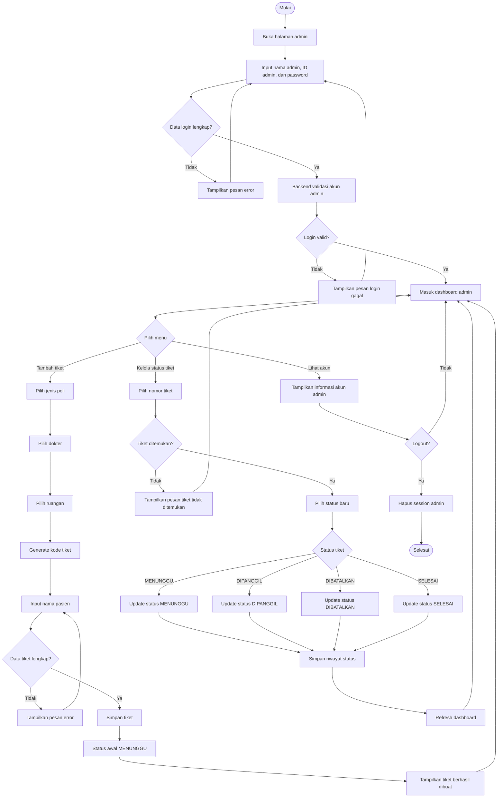
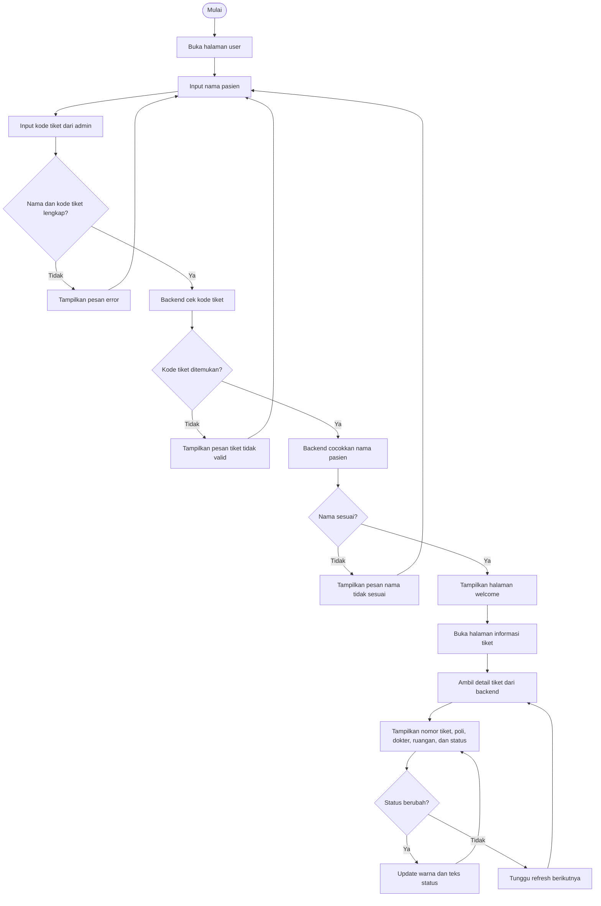

# Flowchart Admin dan User

Dokumen ini berisi flowchart sederhana untuk dua aktor utama aplikasi Waiting List Puskesmas Sekemala: admin dan user/pasien.

## Flowchart Admin



## Flowchart User / Pasien



## Warna Status Tiket

| Status | Warna |
| --- | --- |
| MENUNGGU | Kuning |
| DIPANGGIL | Biru |
| DIBATALKAN | Merah |
| SELESAI | Hijau |

## Ringkasan Alur

| Aktor | Hak akses |
| --- | --- |
| Admin | Login, membuat tiket, mengubah status tiket, melihat akun, logout |
| User/Pasien | Login memakai nama dan kode tiket dari admin, melihat informasi tiket, memantau status tiket |

## Struktur Database Untuk Backend

Bagian ini menjelaskan primary key, foreign key, unique key, dan field penting agar backend tidak salah membuat struktur database.

### Tabel `admins`

Menyimpan data admin. Admin dibuat manual oleh backend, bukan lewat sign up publik.

| Field | Key | Tipe disarankan | Keterangan |
| --- | --- | --- | --- |
| `id` | PK | bigint | ID internal admin |
| `admin_code` | UK | varchar(30) | ID login admin, contoh `ADM001` |
| `name` | - | varchar(100) | Nama admin |
| `email` | UK | varchar(150) | Email admin |
| `phone` | - | varchar(30) | Nomor telepon admin |
| `password_hash` | - | varchar(255) | Password yang sudah di-hash |
| `role` | - | enum | `SUPER_ADMIN` atau `ADMIN` |
| `status` | - | enum | `ACTIVE` atau `INACTIVE` |
| `last_login_at` | - | datetime nullable | Waktu login terakhir |
| `created_at` | - | datetime | Waktu dibuat |
| `updated_at` | - | datetime | Waktu diubah |

### Tabel `patients`

Menyimpan data pasien yang dibuatkan tiket oleh admin.

| Field | Key | Tipe disarankan | Keterangan |
| --- | --- | --- | --- |
| `id` | PK | bigint | ID internal pasien |
| `name` | - | varchar(100) | Nama pasien |
| `phone` | - | varchar(30) nullable | Nomor telepon pasien, opsional |
| `created_at` | - | datetime | Waktu dibuat |
| `updated_at` | - | datetime | Waktu diubah |

### Tabel `clinics`

Master data poli.

| Field | Key | Tipe disarankan | Keterangan |
| --- | --- | --- | --- |
| `id` | PK | bigint | ID poli |
| `name` | UK | varchar(100) | Nama poli, contoh `Poli Umum` |
| `status` | - | enum | `ACTIVE` atau `INACTIVE` |
| `created_at` | - | datetime | Waktu dibuat |
| `updated_at` | - | datetime | Waktu diubah |

### Tabel `doctors`

Master data dokter.

| Field | Key | Tipe disarankan | Keterangan |
| --- | --- | --- | --- |
| `id` | PK | bigint | ID dokter |
| `clinic_id` | FK | bigint | Relasi ke `clinics.id` |
| `name` | - | varchar(150) | Nama dokter |
| `specialization` | - | varchar(100) nullable | Spesialisasi dokter |
| `status` | - | enum | `ACTIVE` atau `INACTIVE` |
| `created_at` | - | datetime | Waktu dibuat |
| `updated_at` | - | datetime | Waktu diubah |

### Tabel `rooms`

Master data ruangan.

| Field | Key | Tipe disarankan | Keterangan |
| --- | --- | --- | --- |
| `id` | PK | bigint | ID ruangan |
| `name` | UK | varchar(100) | Nama ruangan, contoh `Ruangan 2` |
| `status` | - | enum | `ACTIVE` atau `INACTIVE` |
| `created_at` | - | datetime | Waktu dibuat |
| `updated_at` | - | datetime | Waktu diubah |

### Tabel `tickets`

Menyimpan tiket antrian pasien.

| Field | Key | Tipe disarankan | Keterangan |
| --- | --- | --- | --- |
| `id` | PK | bigint | ID internal tiket |
| `ticket_code` | UK | varchar(20) | Kode tiket/antrian, contoh `001` |
| `patient_id` | FK | bigint | Relasi ke `patients.id` |
| `clinic_id` | FK | bigint | Relasi ke `clinics.id` |
| `doctor_id` | FK | bigint | Relasi ke `doctors.id` |
| `room_id` | FK | bigint | Relasi ke `rooms.id` |
| `created_by_admin_id` | FK | bigint | Relasi ke `admins.id` |
| `status` | - | enum | `MENUNGGU`, `DIPANGGIL`, `DIBATALKAN`, `SELESAI` |
| `called_at` | - | datetime nullable | Waktu tiket dipanggil |
| `finished_at` | - | datetime nullable | Waktu tiket selesai |
| `canceled_at` | - | datetime nullable | Waktu tiket dibatalkan |
| `created_at` | - | datetime | Waktu dibuat |
| `updated_at` | - | datetime | Waktu diubah |

### Tabel `ticket_status_histories`

Menyimpan riwayat perubahan status tiket.

| Field | Key | Tipe disarankan | Keterangan |
| --- | --- | --- | --- |
| `id` | PK | bigint | ID riwayat |
| `ticket_id` | FK | bigint | Relasi ke `tickets.id` |
| `admin_id` | FK | bigint | Relasi ke `admins.id` |
| `previous_status` | - | enum nullable | Status sebelum diubah |
| `new_status` | - | enum | Status baru |
| `note` | - | varchar(255) nullable | Catatan perubahan |
| `created_at` | - | datetime | Waktu perubahan |

### Tabel `ticket_calls`

Menyimpan riwayat pemanggilan tiket.

| Field | Key | Tipe disarankan | Keterangan |
| --- | --- | --- | --- |
| `id` | PK | bigint | ID pemanggilan |
| `ticket_id` | FK | bigint | Relasi ke `tickets.id` |
| `admin_id` | FK | bigint | Relasi ke `admins.id` |
| `called_at` | - | datetime | Waktu dipanggil |
| `finished_at` | - | datetime nullable | Waktu selesai |
| `status` | - | enum | `ACTIVE`, `FINISHED`, `CANCELED` |
| `created_at` | - | datetime | Waktu dibuat |
| `updated_at` | - | datetime | Waktu diubah |

### Tabel `password_reset_requests`

Menyimpan request lupa password admin.

| Field | Key | Tipe disarankan | Keterangan |
| --- | --- | --- | --- |
| `id` | PK | bigint | ID request reset |
| `admin_id` | FK | bigint | Relasi ke `admins.id` |
| `token_hash` | UK | varchar(255) | Token reset yang sudah di-hash |
| `expires_at` | - | datetime | Waktu token kedaluwarsa |
| `used_at` | - | datetime nullable | Waktu token dipakai |
| `request_ip` | - | varchar(45) nullable | IP request |
| `created_at` | - | datetime | Waktu request dibuat |

## Relasi Database

| Relasi | Kardinalitas | Keterangan |
| --- | --- | --- |
| `admins.id` ke `tickets.created_by_admin_id` | 1 ke banyak | Satu admin dapat membuat banyak tiket |
| `patients.id` ke `tickets.patient_id` | 1 ke banyak | Satu pasien dapat punya banyak tiket |
| `clinics.id` ke `tickets.clinic_id` | 1 ke banyak | Satu poli dapat dipakai banyak tiket |
| `doctors.id` ke `tickets.doctor_id` | 1 ke banyak | Satu dokter dapat menangani banyak tiket |
| `rooms.id` ke `tickets.room_id` | 1 ke banyak | Satu ruangan dapat dipakai banyak tiket |
| `tickets.id` ke `ticket_status_histories.ticket_id` | 1 ke banyak | Satu tiket punya banyak riwayat status |
| `admins.id` ke `ticket_status_histories.admin_id` | 1 ke banyak | Satu admin bisa mengubah banyak status |
| `tickets.id` ke `ticket_calls.ticket_id` | 1 ke banyak | Satu tiket bisa punya log pemanggilan |
| `admins.id` ke `ticket_calls.admin_id` | 1 ke banyak | Satu admin bisa memanggil banyak tiket |
| `admins.id` ke `password_reset_requests.admin_id` | 1 ke banyak | Satu admin bisa punya banyak request reset |

## Constraint Yang Wajib

| Tabel | Constraint |
| --- | --- |
| `admins` | `admin_code` unique |
| `admins` | `email` unique |
| `tickets` | `ticket_code` unique |
| `clinics` | `name` unique |
| `rooms` | `name` unique |
| `password_reset_requests` | `token_hash` unique |

## Index Yang Disarankan

| Tabel | Index |
| --- | --- |
| `tickets` | `ticket_code` |
| `tickets` | `status` |
| `tickets` | `created_at` |
| `ticket_status_histories` | `ticket_id` |
| `ticket_status_histories` | `created_at` |
| `ticket_calls` | `ticket_id` |
| `ticket_calls` | `status` |
| `password_reset_requests` | `expires_at` |

## Seed Data Awal

Admin manual:

```txt
admin_code: ADM001
name: ADMIN SEKEMALA
email: admin@puskesmassekemala.test
phone: 081234567890
role: SUPER_ADMIN
status: ACTIVE
```

Master poli:

```txt
Poli Gigi
Poli Umum
Poli Anak
Poli Lansia
```

Master dokter:

```txt
drg. Andi Pratama, Sp.KG
dr. Siti Aminah
dr. Budi Santoso
```

Master ruangan:

```txt
Ruangan 1
Ruangan 2
Ruangan 3
Ruangan 4
```
