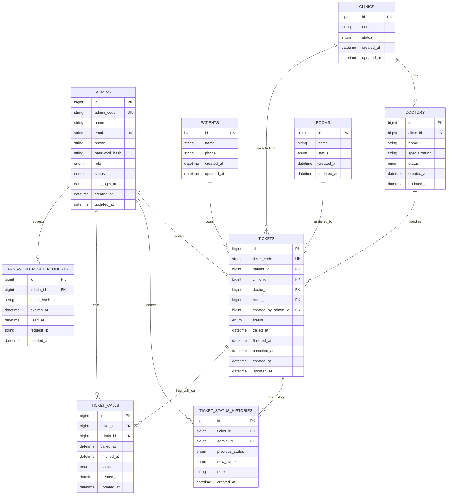

# Backend ERD Waiting List App Puskesmas Sekemala

Dokumen ini adalah rancangan database untuk backend. Rancangan ini tidak mengikuti `localStorage`, tetapi sudah disiapkan untuk database relasional seperti MySQL atau PostgreSQL.

## Diagram ERD



## Enum Yang Disarankan

| Enum | Value |
| --- | --- |
| `admins.role` | `SUPER_ADMIN`, `ADMIN` |
| `admins.status` | `ACTIVE`, `INACTIVE` |
| `clinics.status` | `ACTIVE`, `INACTIVE` |
| `doctors.status` | `ACTIVE`, `INACTIVE` |
| `rooms.status` | `ACTIVE`, `INACTIVE` |
| `tickets.status` | `MENUNGGU`, `DIPANGGIL`, `DIBATALKAN`, `SELESAI` |
| `ticket_calls.status` | `ACTIVE`, `FINISHED`, `CANCELED` |

## Catatan Tabel

### ADMINS

Admin dibuat manual oleh backend, bukan lewat sign up publik. Password harus disimpan dalam bentuk hash, misalnya `bcrypt` atau `argon2`.

Minimal akun seed:

```txt
admin_code: ADM001
name: ADMIN SEKEMALA
email: admin@puskesmassekemala.test
phone: 081234567890
role: SUPER_ADMIN
status: ACTIVE
```

### PATIENTS

Pasien dibuat saat admin membuat tiket. Untuk versi awal, cukup simpan nama pasien. Nomor telepon opsional.

### CLINICS, DOCTORS, ROOMS

Master data untuk pilihan poli, dokter, dan ruangan. Frontend sekarang punya pilihan:

```txt
Poli Gigi, Poli Umum, Poli Anak, Poli Lansia
drg. Andi Pratama, Sp.KG; dr. Siti Aminah; dr. Budi Santoso
Ruangan 1, Ruangan 2, Ruangan 3, Ruangan 4
```

### TICKETS

Tiket dibuat admin dan status awalnya `MENUNGGU`. User/pasien hanya bisa cek tiket jika `ticket_code` dan `patient.name` cocok.

### TICKET_STATUS_HISTORIES

Setiap perubahan status tiket wajib masuk ke history. Ini penting untuk audit.

### TICKET_CALLS

Mencatat log pemanggilan tiket. Saat status tiket menjadi `DIPANGGIL`, backend membuat call log aktif. Saat status `SELESAI`, call log aktif ditutup.

### PASSWORD_RESET_REQUESTS

Dipakai untuk forgot password. Frontend tidak boleh langsung mengganti password. Backend membuat token reset yang dikirim ke email admin.

## Index Dan Constraint Penting

| Tabel | Constraint / Index |
| --- | --- |
| `admins` | unique `admin_code`, unique `email` |
| `tickets` | unique `ticket_code` |
| `tickets` | index `status`, index `created_at` |
| `ticket_status_histories` | index `ticket_id`, index `created_at` |
| `ticket_calls` | index `ticket_id`, index `status` |
| `password_reset_requests` | index `token_hash`, index `expires_at` |

## Endpoint Minimal Untuk Frontend

| Method | Endpoint | Fungsi |
| --- | --- | --- |
| `POST` | `/api/admin/login` | Login admin |
| `POST` | `/api/admin/logout` | Logout admin |
| `GET` | `/api/admin/me` | Ambil session admin aktif |
| `POST` | `/api/admin/forgot-password` | Request reset password |
| `GET` | `/api/tickets` | List tiket untuk dashboard admin |
| `POST` | `/api/tickets` | Admin membuat tiket |
| `GET` | `/api/tickets/next-code` | Ambil kode tiket berikutnya |
| `PATCH` | `/api/tickets/:ticketCode/status` | Admin mengubah status tiket |
| `GET` | `/api/tickets/verify` | Pasien verifikasi tiket dengan nama dan kode |
| `GET` | `/api/tickets/:ticketCode` | Ambil detail tiket |
| `GET` | `/api/master/clinics` | Ambil master poli |
| `GET` | `/api/master/doctors` | Ambil master dokter |
| `GET` | `/api/master/rooms` | Ambil master ruangan |

## Response Status Tiket Untuk Frontend

Frontend butuh field ini saat menampilkan informasi tiket:

```json
{
  "ticketCode": "001",
  "patientName": "Nurul",
  "clinicName": "Poli Umum",
  "doctorName": "drg. Andi Pratama, Sp.KG",
  "roomName": "Ruangan 2",
  "status": "DIPANGGIL"
}
```

