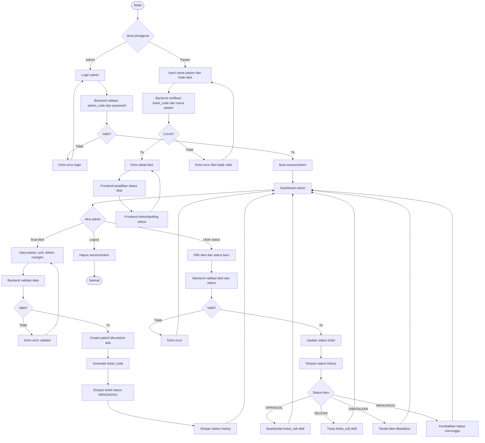
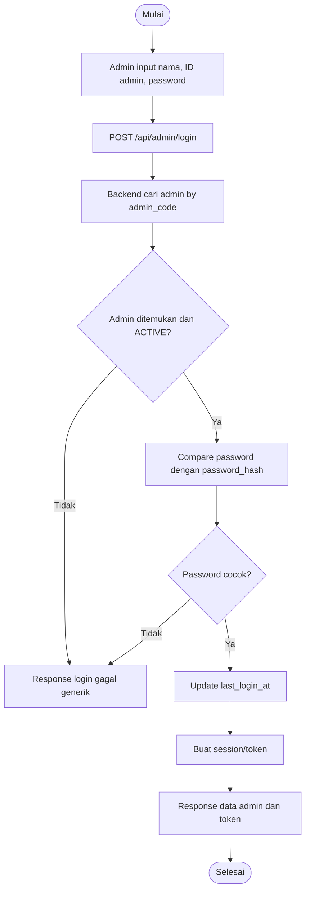
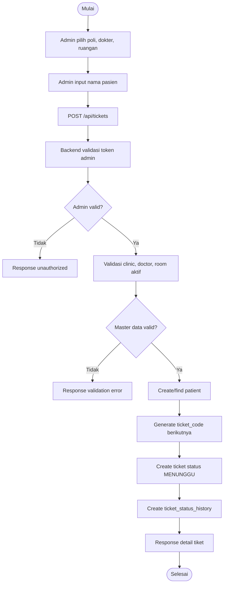
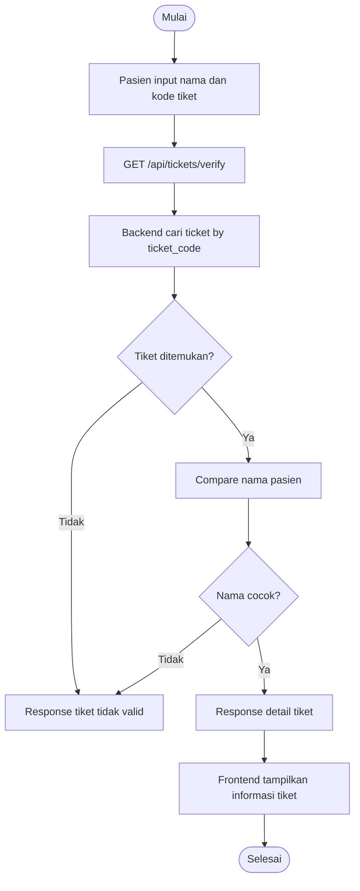
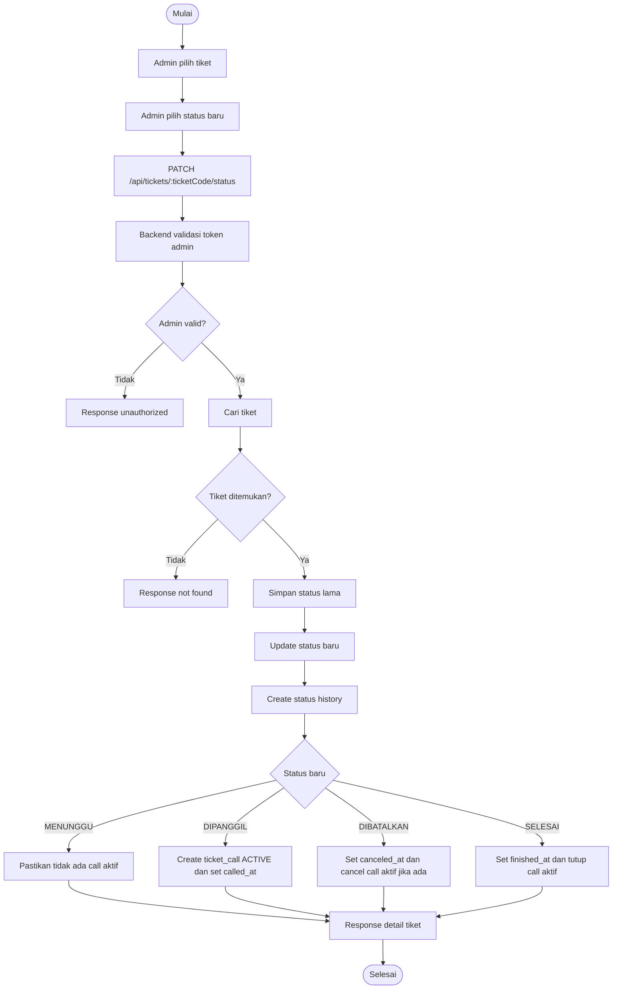
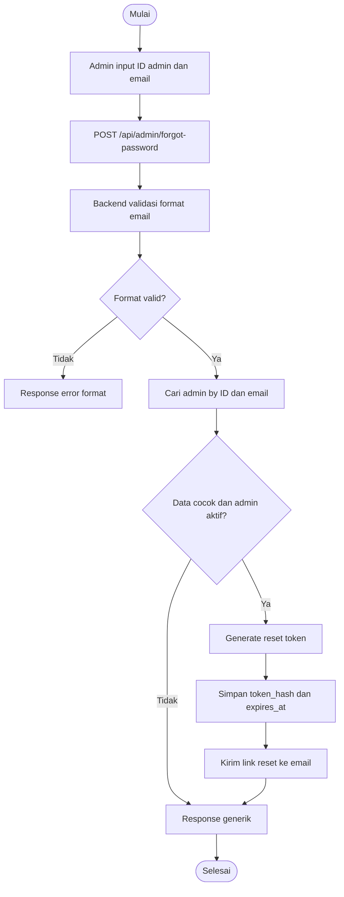

# Backend Flowchart Waiting List App Puskesmas Sekemala

Dokumen ini menjelaskan alur sistem yang perlu dipikirkan backend. Fokus utamanya adalah autentikasi admin, pembuatan tiket oleh admin, validasi tiket pasien, update status, dan forgot password yang aman.

## Flowchart Sistem Utama



## Flowchart Login Admin



## Flowchart Buat Tiket Admin



## Flowchart Validasi Tiket Pasien



## Flowchart Update Status Tiket



## Flowchart Forgot Password Aman



## Catatan Keamanan Backend

| Area | Rekomendasi |
| --- | --- |
| Admin account | Dibuat manual lewat seeder atau superadmin, bukan sign up publik |
| Password | Simpan `password_hash`, jangan simpan password asli |
| Login error | Gunakan pesan generik agar akun tidak mudah ditebak |
| Session | Gunakan HttpOnly cookie atau token yang aman |
| Forgot password | Gunakan token sekali pakai, expired 10-15 menit |
| Rate limit | Batasi login dan forgot password |
| Audit | Simpan history perubahan status tiket |
| Authorization | Semua endpoint admin wajib cek token/session |

## Kontrak Data Frontend

### Login Admin

Request:

```json
{
  "adminId": "ADM001",
  "password": "AdminSekemala2026!"
}
```

Response sukses:

```json
{
  "admin": {
    "adminId": "ADM001",
    "name": "ADMIN SEKEMALA",
    "email": "admin@puskesmassekemala.test",
    "phone": "081234567890",
    "role": "SUPER_ADMIN"
  },
  "token": "session-or-jwt-token"
}
```

### Buat Tiket

Request:

```json
{
  "patientName": "Nurul",
  "clinicId": 2,
  "doctorId": 1,
  "roomId": 2
}
```

Response:

```json
{
  "ticketCode": "001",
  "patientName": "Nurul",
  "clinicName": "Poli Umum",
  "doctorName": "drg. Andi Pratama, Sp.KG",
  "roomName": "Ruangan 2",
  "status": "MENUNGGU"
}
```

### Verifikasi Tiket Pasien

Request:

```txt
GET /api/tickets/verify?ticketCode=001&patientName=Nurul
```

Response:

```json
{
  "ticketCode": "001",
  "patientName": "Nurul",
  "clinicName": "Poli Umum",
  "doctorName": "drg. Andi Pratama, Sp.KG",
  "roomName": "Ruangan 2",
  "status": "DIPANGGIL"
}
```

