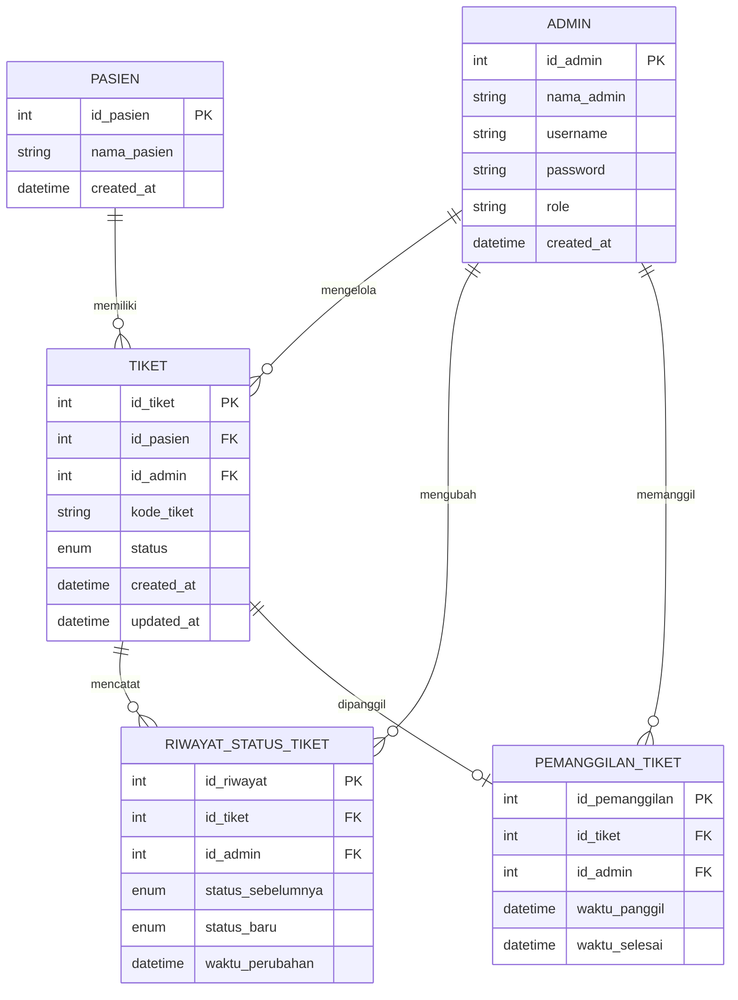

# ERD Waiting List App Puskesmas Sekemala

ERD ini dibuat berdasarkan alur aplikasi saat ini. Data aplikasi masih disimpan di `localStorage`, jadi rancangan di bawah bisa dipakai sebagai rancangan database relasional jika aplikasi dikembangkan memakai MySQL, PostgreSQL, atau database lain.

## Diagram ERD

## Keterangan Tabel

### ADMIN

Menyimpan data admin yang login dan mengelola antrian.

| Field | Keterangan |
| --- | --- |
| id_admin | Primary key admin |
| nama_admin | Nama admin |
| username | Username atau ID admin |
| password | Password admin |
| role | Peran admin, misalnya Administrator |
| created_at | Tanggal data admin dibuat |

### PASIEN

Menyimpan data pasien yang mengambil tiket.

| Field | Keterangan |
| --- | --- |
| id_pasien | Primary key pasien |
| nama_pasien | Nama pasien |
| created_at | Tanggal data pasien dibuat |

### TIKET

Menyimpan data tiket antrian pasien.

| Field | Keterangan |
| --- | --- |
| id_tiket | Primary key tiket |
| id_pasien | Foreign key ke tabel PASIEN |
| id_admin | Foreign key ke tabel ADMIN, nullable jika tiket dibuat oleh pasien |
| kode_tiket | Kode tiket/antrian, contoh: 001 |
| status | Status tiket: MENUNGGU, DIPANGGIL, DIBATALKAN, SELESAI |
| created_at | Tanggal tiket dibuat |
| updated_at | Tanggal tiket terakhir diperbarui |

### RIWAYAT_STATUS_TIKET

Menyimpan histori perubahan status tiket.

| Field | Keterangan |
| --- | --- |
| id_riwayat | Primary key riwayat |
| id_tiket | Foreign key ke tabel TIKET |
| id_admin | Foreign key ke tabel ADMIN |
| status_sebelumnya | Status tiket sebelum diubah |
| status_baru | Status tiket setelah diubah |
| waktu_perubahan | Waktu perubahan status |

### PEMANGGILAN_TIKET

Menyimpan tiket yang sedang atau pernah dipanggil.

| Field | Keterangan |
| --- | --- |
| id_pemanggilan | Primary key pemanggilan |
| id_tiket | Foreign key ke tabel TIKET |
| id_admin | Foreign key ke tabel ADMIN yang memanggil tiket |
| waktu_panggil | Waktu tiket dipanggil |
| waktu_selesai | Waktu pelayanan selesai, nullable jika belum selesai |

## Relasi

| Relasi | Kardinalitas | Keterangan |
| --- | --- | --- |
| ADMIN ke TIKET | 1 ke banyak | Satu admin dapat membuat atau mengelola banyak tiket |
| PASIEN ke TIKET | 1 ke banyak | Satu pasien dapat memiliki lebih dari satu tiket |
| TIKET ke RIWAYAT_STATUS_TIKET | 1 ke banyak | Satu tiket dapat punya banyak riwayat perubahan status |
| ADMIN ke RIWAYAT_STATUS_TIKET | 1 ke banyak | Satu admin dapat melakukan banyak perubahan status |
| TIKET ke PEMANGGILAN_TIKET | 1 ke 0 atau 1 | Satu tiket dapat belum dipanggil atau memiliki satu data pemanggilan aktif |
| ADMIN ke PEMANGGILAN_TIKET | 1 ke banyak | Satu admin dapat memanggil banyak tiket |

## Catatan Implementasi Saat Ini

Pada kode aplikasi saat ini, data yang benar-benar disimpan hanya:

- `waitingTickets`: berisi array tiket dengan field `code`, `name`, dan `status`.
- `currentCallTicket`: berisi kode tiket yang sedang dipanggil.
- `adminSession`: berisi `adminName`, `adminId`, dan `role`.

Karena belum ada backend/database, tabel `PASIEN`, `RIWAYAT_STATUS_TIKET`, dan `PEMANGGILAN_TIKET` adalah rancangan normalisasi agar sistem lebih siap dikembangkan.
