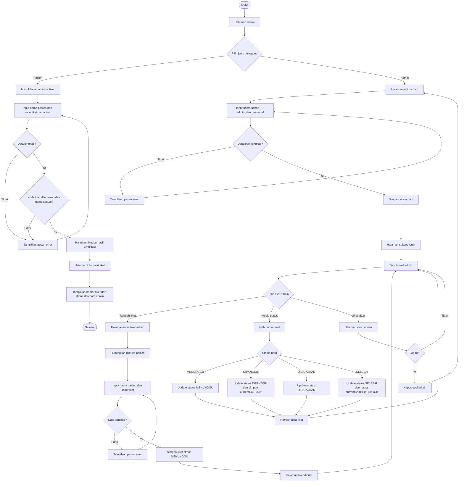
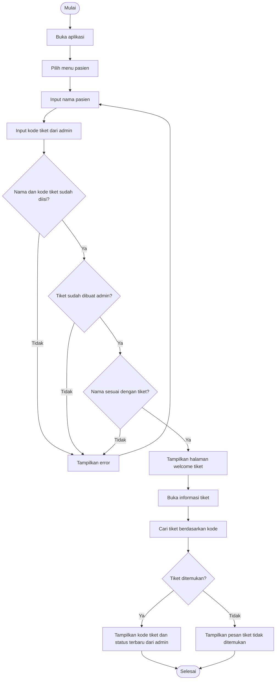
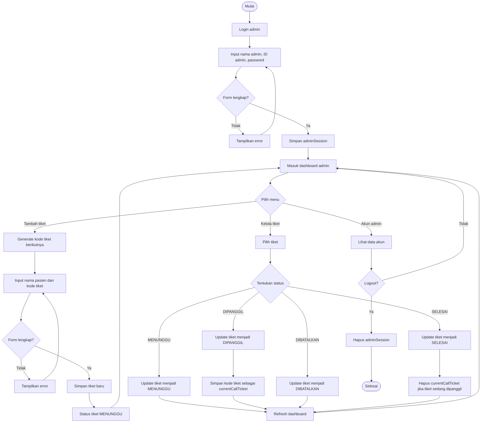

# Flowchart Waiting List App Puskesmas Sekemala

Flowchart ini menggambarkan alur utama aplikasi waiting list, yaitu alur pasien mengambil/cek tiket dan alur admin mengelola status antrian.

## Flowchart Utama

## Flowchart Pasien

## Flowchart Admin

## Keterangan Simbol

| Simbol | Arti |
| --- | --- |
| Oval | Mulai atau selesai proses |
| Persegi panjang | Proses atau aktivitas |
| Belah ketupat | Percabangan atau keputusan |
| Panah | Arah alur proses |

## Catatan

Flowchart ini mengikuti fitur yang ada di aplikasi:

- Pasien dapat memasukkan nama dan kode tiket.
- Tiket disimpan dengan status awal `MENUNGGU`.
- Admin dapat login, membuat tiket, memilih tiket, dan mengubah status.
- Status tiket yang digunakan adalah `MENUNGGU`, `DIPANGGIL`, `DIBATALKAN`, dan `SELESAI`.
- Tiket yang sedang dipanggil disimpan sebagai `currentCallTicket`.
